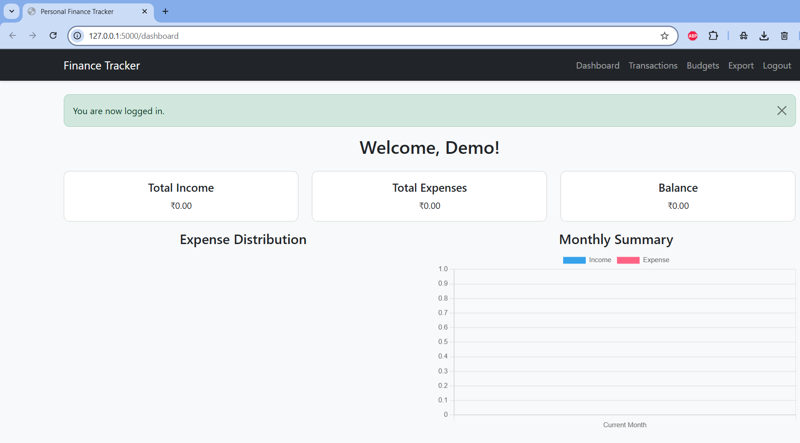
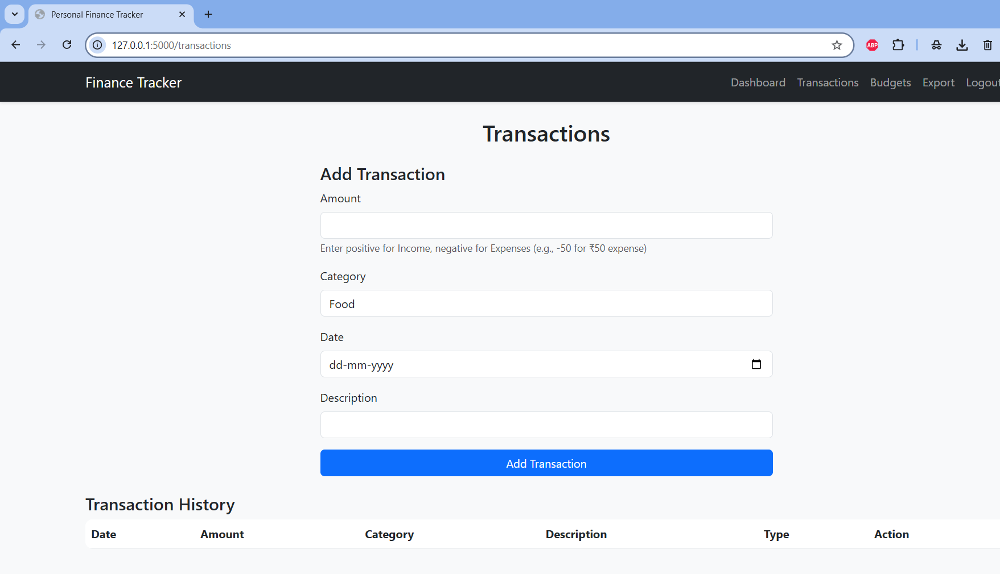
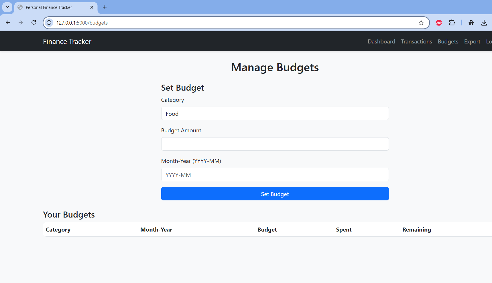

 
# 💸 Expense Tracking and Financial Data Visualizer

A full-stack personal finance tracker that allows users to log income and expenses, set monthly budgets, and visualize their financial data with interactive charts. Built using **Flask**, **MySQL**, **WTForms**, and **Chart.js**.

---

## 📌 Features

- 🔐 User Registration and Login
- 💰 Transaction Management: Add, view, and delete income and expense entries.
    ---> Enter positive amounts for income (e.g., 500)
    ---> Enter negative amounts for expenses (e.g., -250)
    
- 📊 Dashboard with:
  - Total income, expenses, and balance
  - Pie chart of expense categories
  - Bar chart of income vs expenses
- 📝 Set monthly budgets per category
- ⚠️ Get alerts when you're near or over budget
- 📤 Export transactions as CSV
- 🎨 Clean and responsive UI with Bootstrap 5

---

## 🖼️ Screenshots

| Dashboard | Transactions | Budgets |
|----------|--------------|---------|
|  |  |  |

---

## 🛠️ Tech Stack

- **Backend**: Flask, Python, MySQL, WTForms
- **Frontend**: HTML, Bootstrap 5, Chart.js
- **Environment**: dotenv for secure credentials
- **Security**: Password hashing, session-based auth

---

## 🚀 Setup Instructions

1. **Clone the repo**
   
   git clone https://github.com/akanksharawal1/expense-tracking-financial-visualizer.git
   cd expense-tracking-financial-visualizer

2. **Create and Activate Virtual Environment on Terminal**
    For Windows :-
        python -m venv venv
        venv\Scripts\activate

3. **Install Dependencies**
    pip install -r requirements.txt

4. **Create .env File**


    Create a `.env` file in the root directory and add your credentials like this:

    ```env
    SECRET_KEY=your_secret_key
    DB_HOST=localhost
    DB_USER=root
    DB_PASSWORD=your_password
    DB_NAME=your_database_name
    DB_CHARSET=utf8mb4
    ```

5. **Run the App**

    python app.py
    App will run at: http://127.0.0.1:5000